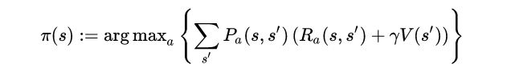
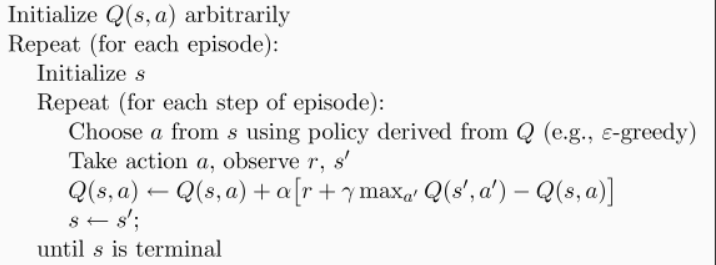
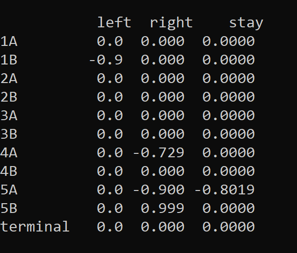

# 基於 Markov Decision Process 之超級迷你黑白棋AI

Markov Decision Process



Q learning



## 進入正題前的小測試

### Treasure on right ---o---T
State     : position

Reward    : found treasure ? 1 : 0

Actions   : left, right

Terminal  : found treasure

learning function
```

```
[video link]()

Reference: [莫烦python](https://morvanzhou.github.io/tutorials/machine-learning/reinforcement-learning/)

#### 與雙人對局遊戲的差異
對戰模式下，環境是未知的
+ 一方學習一方隨機？  
  + 容易高估自己的優勢
+ 遇到相同棋面但輪到不同方？  
  + 在state裡加入輪到誰下

### Two treasures A---a---B
State     : position + whose turn

Reward    : found my treasure ? 1 : found opponent treasure ? -1 : 0

Actions   : left, right, *stay*

Terminal  : anyone found any treasure

leaning function
```

```
[video link]()

### 小插曲



只有下一步是正值才會更新？
+ 因為 max 過程（也符合對戰的假設）

那負值有用途？
+ 當下一步造成對手action都是負值時，對手就算 max 了還是負，那這時就會更新了

## Othello

State     : chess situation + whose turn

Reward(color) : color win ? 1 : color lose ? -1 : 0

Actions   : legal steps

Terminal  : no one has legal steps

leaning function
```

```
[video link]()


